## 引言

​	MHA解决了mysql数据库单点故障，提高了数据的安全性。

## 一、概述

### 1.1、什么是 MHA

- MHA（MasterHigh Availability）是一套优秀的MySQL高可用环境下故障切换和主从复制的软件。
- MHA 的出现就是解决MySQL 单点的问题。
- MySQL故障切换过程中，MHA能做到0-30秒内自动完成故障切换操作。
- MHA能在故障切换的过程中最大程度上保证数据的一致性，以达到真正意义上的高可用。

### 1.2、MHA 的组成

- MHA Node（数据节点）
  MHA Node 运行在每台 MySQL 服务器上。
- HA Manager（管理节点）
  MHA Manager 可以单独部署在一台独立的机器上，管理多个 master-slave 集群；也可以部署在一台 slave 节点上。
  MHA Manager 会定时探测集群中的 master 节点。当 master 出现故障时，它可以自动将最新数据的 slave 提升为新的 master， 然后将所有其他的 slave 重新指向新的 master。整个故障转移过程对应用程序完全透明。

### 1.3、MHA 的特点

- 自动故障切换过程中，MHA试图从宕机的主服务器上保存二进制日志，最大程度的保证数据不丢失
- 使用半同步复制，可以大大降低数据丢失的风险，如果只有一个slave已经收到了最新的二进制日志，MHA可以将最新的二进制日志应用于其他所有的slave服务器上，因此可以保证所有节点的数据一致性
- 目前MHA支持一主多从架构，最少三台服务，即一主两从

### 1.4、数据流向

​	数据先经过master通过manger管理数据分配，然后当主服务器挂了之后，需要去匹配从服务器最接近主服务器内容的顶上去，通过vip去进行地址漂移，此时从服务器变成了主服务器，接下来就是[主从复制](https://so.csdn.net/so/search?q=主从复制&spm=1001.2101.3001.7020)+读写分离原理。

## 二、MHA工作原理总结

1. 从宕机崩溃的master 保存二进制日志事件（binlog events）；
2. 识别含有最新的更新slave日志
3. 应用差异的中继日志（relay log）到其他的slave
4. 应用从master保存的二进制日志事件
5. 提升一个slave为新的master
6. 使其他的slave连接行的master进行复制

## 三、搭建 MySQL MHA

### 实验思路：

1、MHA架构
	  数据库安装
	  一主两从
	MHA搭建

2、故障模拟
	  模拟主库失效
	  备选主库成为主库
	  原故障主库恢复重新加入到MHA成为从库

| 节点服务器             | 系统             | 主机名  | IP地址      | 安装服务及工具               |
| ---------------------- | ---------------- | ------- | ----------- | ---------------------------- |
| MHA manager 节点服务器 | CentOS7.6(64 位) | manager | 10.10.0.128 | 安装MHA node 和 manager 组件 |
| Master 节点服务器      | CentOS7.6(64 位) | master  | 10.10.0.129 | 安装mysql5.7、MHA node 组件  |
| Slave1 节点服务器      | CentOS7.6(64 位) | slave1  | 10.10.0.130 | 安装mysql5.7、MHA node 组件  |
| Slave2 节点服务器      | CentOS7.6(64 位) | slave2  | 10.10.0.131 | 安装mysql5.7、MHA node 组件  |

### 3.1、配置主从复制

#### 1.初始化环境

**在四台服务器上初始化环境** 

```shell
[root@localhost ~]# systemctl stop firewalld 
[root@localhost ~]# systemctl disable firewalld 
[root@localhost ~]# sestatus
[root@localhost ~]# setenforce 0
```

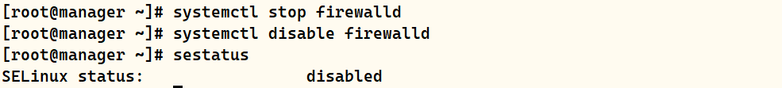

#### 2.修改 Master、Slave1、Slave2 节点的主机名

```shell
10.10.0.129
[root@localhost ~]# hostnamectl set-hostname Master
10.10.0.130
[root@localhost ~]# hostnamectl set-hostname Slave1
10.10.0.131
[root@localhost ~]# hostnamectl set-hostname Slave2
```

#### 3.在Master、Slave1、Slave2添加域名解析

**master服务器、slave1、slave2**

```shell
vim /etc/hosts 

10.10.0.129 master
10.10.0.130 slave1
10.10.0.131 slave2
```

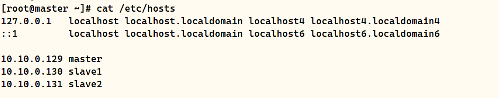

#### 4.在Master、Slave1、Slave2安装MySQL 5.7.25

##### 4.1 创建安装账户

```shell
[root@master ~]# useradd -s /bin/false -d /usr/local/mysql mysql

[root@master ~]# id mysql
uid=1001(mysql) gid=1001(mysql) 组=1001(mysql)
```

##### 4.2 安装过程

```shell
[root@master ~]# tar -xvf mysql-5.7.25-el7-x86_64.tar 
mysql-5.7.25-el7-x86_64.tar.gz
mysql-test-5.7.25-el7-x86_64.tar.gz

[root@master ~]# tar -zxvf mysql-5.7.25-el7-x86_64.tar.gz -C /usr/local/mysql/
[root@master ~]# cd /usr/local/mysql/mysql-5.7.25-el7-x86_64/
[root@master mysql-5.7.25-el7-x86_64]# mv * ../
[root@master mysql-5.7.25-el7-x86_64]# cd ../
[root@master mysql]# rmdir mysql-5.7.25-el7-x86_64/
[root@master mysql]# mkdir data
[root@master mysql]# chown -R mysql:mysql ../mysql/
[root@master mysql]# cd bin/

[root@master bin]# ./mysqld --user=mysql --basedir=/usr/local/mysql --datadir=/usr/local/mysql/data --initialize
#输出内容最后一行的最后内容为初始密码

[root@master bin]# cp ../support-files/mysql.server /etc/init.d/mysqld

[root@master bin]# vim /etc/my.cnf
[root@master bin]# cat /etc/my.cnf
[mysqld]
basedir = /usr/local/mysql
datadir = /usr/local/mysql/data
socket = /tmp/mysql.sock
log-error = /usr/local/mysql/data/error.log
pid-file = /usr/local/mysql/data/mysql.pid

!includedir /etc/my.cnf.d

[root@master ~]# vim /etc/profile
#最后一行添加以下内容
export PATH=$PATH:/usr/local/mysql/bin

[root@master ~]# source /etc/profile
```

##### 4.3 添加服务

```shell
[root@master ~]# chkconfig --add mysqld
```

##### 4.4 启动服务

```shell
[root@master ~]# service mysqld start

[root@master ~]# mysql -u root -p
mysql> set password=password('li@1998..');
```

#### 5.配置主从同步

```shell
#Master 节点
vim /etc/my.cnf

[mysqld]
server-id = 1
log_bin = master-bin
log-slave-updates = true

systemctl restart mysqld
=====================================END========================================
#Slave1 节点
vim /etc/my.cnf

#三台服务器的 server-id 不能一样
[mysqld]
server-id = 2
log_bin = master-bin
relay-log = relay-log-bin
relay-log-index = slave-relay-bin.index
relay_log_purge=0

systemctl restart mysqld
=====================================END========================================
#Slave2 节点
vim /etc/my.cnf

#三台服务器的 server-id 不能一样
[mysqld]
server-id = 3
log_bin = master-bin
relay-log = relay-log-bin
relay-log-index = slave-relay-bin.index
relay_log_purge=0

systemctl restart mysqld
```

#### 6. Master、Slave1、Slave2 节点上都创建两个软链接

```shell
ln -s /usr/local/mysql/bin/mysql /usr/sbin/
ln -s /usr/local/mysql/bin/mysqlbinlog /usr/sbin/

#查看软链接
ls -lrth /usr/sbin/mysql*
```


#### 7.配置 mysql 一主两从

```shell
所有数据库节点进行 mysql 授权 
mysql -uroot -p123456

#从数据库同步使用
mysql> grant replication slave on *.* to 'myslave'@'10.10.0.%' identified by '123456';
#manager使用
mysql> grant all privileges on *.* to 'mha'@'10.10.0.%' identified by 'manager';

#防止从库通过主机名连接不上主库
mysql> grant all privileges on *.* to 'mha'@'master' identified by 'manager';
mysql> grant all privileges on *.* to 'mha'@'slave1' identified by 'manager';
mysql> grant all privileges on *.* to 'mha'@'slave2' identified by 'manager';

#刷新库
mysql> flush privileges;
```

#### 8.在 Master 节点查看二进制文件和同步点，在 Slave1、Slave2 节点执行同步操作

```shell
#Master节点
mysql> show master status; 
```

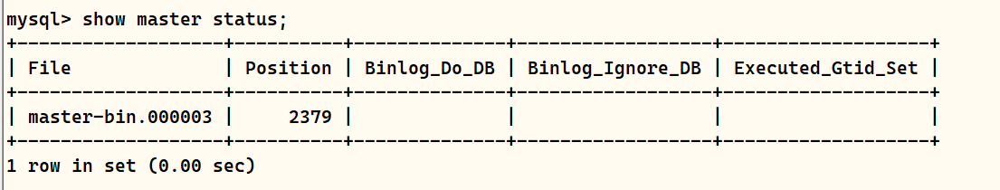

```shell
#slave节点

mysql> change master to
master_host='10.10.0.129',master_user='myslave',master_password='123456',master_log_file='master-bin.000003',master_log_pos=2379;

mysql> start slave;

#在 Slave1、Slave2 节点查看数据同步结果
mysql> show slave status\G

#确保 IO 和 SQL 线程都是 Yes，代表同步正常。
Slave_IO_Running: Yes
Slave_SQL_Running: Yes
```

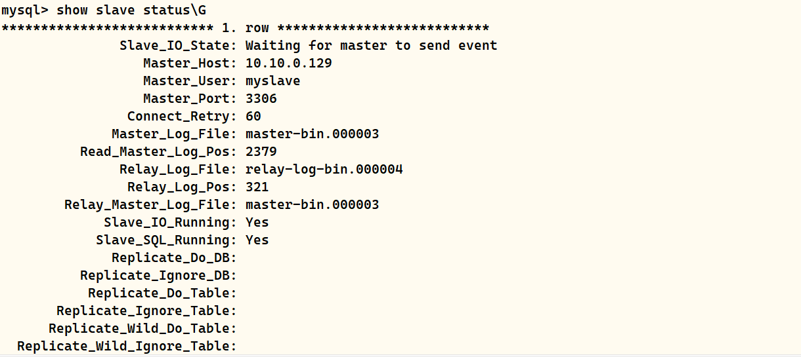

#### 9.设置两个从节点为只读模式

```shell
#slave1、slave2节点执行

mysql> set global read_only=1;
mysql> show global variables like '%read_only%';
```

#### 10.验证主从同步

```shell
#在主master上创建库、表并插入数据
mysql> create database test;
mysql> use test;

mysql> create table test(id int(8),name varchar(10));
mysql> insert into test values(1,'xiaojian');

#在slave1、slave2上验证
mysql> select * from test.test;
```

### 3.2 安装 MHA 软件

#### 1.所有服务器上都安装 MHA 依赖的环境，首先安装 epel 源

```shell
#所有服务器上都安装 MHA 依赖的环境。
#首先安装 epel 源
yum install epel-release --nogpgcheck -y 

yum install -y perl-DBD-MySQL \
perl-Config-Tiny \
perl-Log-Dispatch \
perl-Parallel-ForkManager \
perl-ExtUtils-CBuilder \
perl-ExtUtils-MakeMaker \
perl-CPAN
```

**manger节点**

```shell
[root@manager opt]# tar -zxvf mha4mysql-node-0.57.tar.gz

[root@manager opt]# cd mha4mysql-node-0.57
[root@manager mha4mysql-node-0.57]# perl Makefile.PL

[root@manager mha4mysql-node-0.57]# make && make install
输出结果如下（参考）：
```

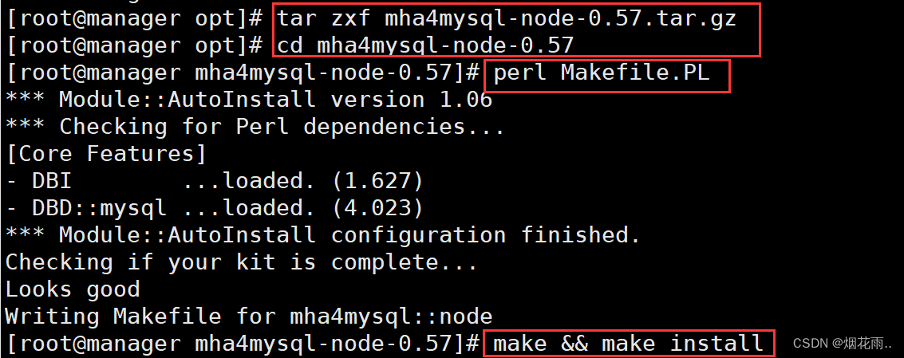

#### 2.安装 MHA 软件包，先在所有服务器上必须先安装 node 组件

- 对于每个操作系统版本不一样，这里 CentOS7.6选择 0.57 版本。
- 在所有服务器上必须先安装 node 组件，最后在 MHA-manager 节点上安装 manager 组件，因为 manager 依赖 node 组件。

```shell
#将需要的包下载到/opt下
#每台服务器上解压安装node组件

cd /opt
tar -zvvf mha4mysql-node-0.57.tar.gz

cd mha4mysql-node-0.57
perl Makefile.PL

make && make install
```

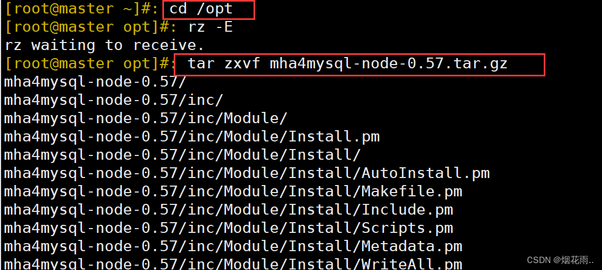

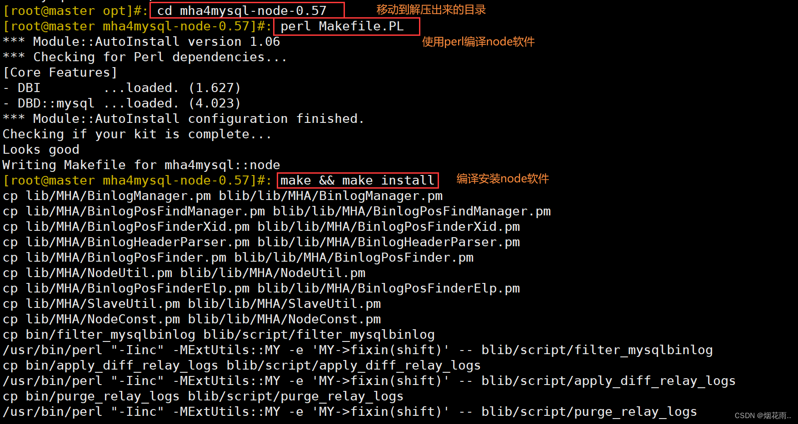

#### 3.在 MHA-manager 节点上安装 manager 组件

```shell
tar -zxvf mha4mysql-manager-0.57.tar.gz

cd mha4mysql-manager-0.57/
perl Makefile.PL

make && make install
```

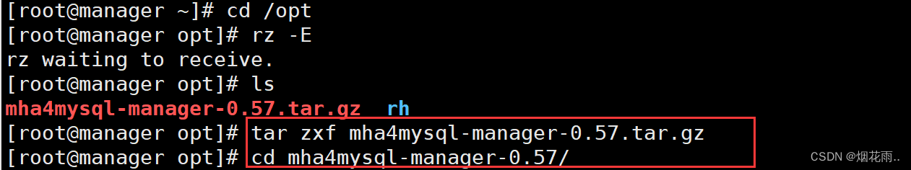

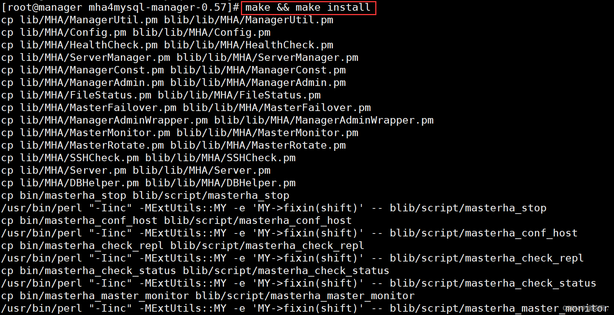

```shell
cd /usr/local/bin/ 
#manager 组件安装后在/usr/local/bin 下面会生成几个工具，主要包括以下几个：

masterha_check_ssh		#检查 MHA 的 SSH 配置状况 
masterha_check_repl		#检查 MySQL 复制状况
masterha_manger			#启动 manager的脚本
masterha_check_status	#检测当前 MHA 运行状态
masterha_master_monitor	#检测 master 是否宕机
masterha_master_switch	#控制故障转移（自动或者 手动）
masterha_conf_host		#添加或删除配置的 server 信息
masterha_stop			#关闭manager

#node 组件安装后也会在/usr/local/bin 
#下面会生成几个脚本（这些工具通常由 MHAManager 的脚本触发，无需人为操作）主要如下：

save_binary_logs		#保存和复制 master 的二进制日志
apply_diff_relay_logs	#识别差异的中继日志事件并将其差异的事件应用于其他的slave
filter_mysqlbinlog		#去除不必要的 ROLLBACK 事件（MHA 已不再使用这个工具）
purge_relay_logs		#清除中继日志（不会阻塞 SQL 线程）
```

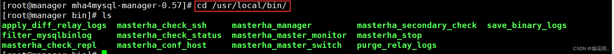

#### 4.在所有服务器上配置无密码认证

```shell
1）在 manager 节点上配置到所有数据库节点的无密码认证(0.128 manager节点、0.129主、0.130从、0.131从)
[root@manager ~]# ssh-keygen -t rsa
#一路按回车键

[root@manager ~]# ssh-copy-id 10.10.0.129
[root@manager ~]# ssh-copy-id 10.10.0.130
[root@manager ~]# ssh-copy-id 10.10.0.131

=====================================END========================================
2）在 master 上配置到数据库节点 slave1 和 slave2 的无密码认证
[root@master ~]# ssh-keygen -t rsa

[root@master ~]# ssh-copy-id 10.10.0.130
[root@master ~]# ssh-copy-id 10.10.0.131

=====================================END========================================
3）在 slave1 上配置到数据库节点 master 和 slave2 的无密码认证
[root@slave1 ~]# ssh-keygen -t rsa

[root@slave1 ~]# ssh-copy-id 10.10.0.129
[root@slave1 ~]# ssh-copy-id 10.10.0.131

=====================================END========================================
4）在 slave2 上配置到数据库节点 master 和 slave1 的无密码认证
[root@slave2 ~]# ssh-keygen -t rsa

[root@slave2 ~]# ssh-copy-id 10.10.0.129
[root@slave2 ~]# ssh-copy-id 10.10.0.130
```

#### 5.在 manager 节点上配置 MHA

```shell
1）在 manager 节点上复制相关脚本到/usr/local/bin目录
[root@manager ~]# cp -rp /opt/mha4mysql-manager-0.58/samples/scripts /usr/local/bin
#拷贝后会有四个执行文件
[root@manager ~]# ll /usr/local/bin/scripts/
################################################################################
master_ip_failover  		#自动切换时 VIP 管理的脚本
master_ip_online_change 	#在线切换时 vip 的管理
power_manager 				#故障发生后关闭主机的脚本
send_report 				#因故障切换后发送报警的脚本
################################################################################
```

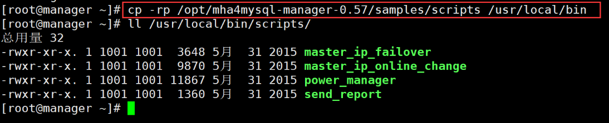


```shell
2）复制上述的自动切换时VIP管理的脚本到 /usr/local/bin 目录，这里使用master_ip_failover脚本来管理 VIP 和故障切换
[root@manager ~]# cp /usr/local/bin/scripts/master_ip_failover /usr/local/bin
```

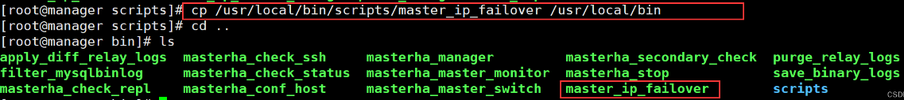


```shell
3）修改内容如下：（删除原有内容，直接复制并修改vip相关参数）
vim /usr/local/bin/master_ip_failover
#!/usr/bin/env perl
use strict;
use warnings FATAL => 'all';

use Getopt::Long;

my (
$command, $ssh_user, $orig_master_host, $orig_master_ip,
$orig_master_port, $new_master_host, $new_master_ip, $new_master_port
);
#############################添加内容部分#########################################
#指定vip的地址
my $vip = '10.10.0.188';
#指定vip的广播地址
my $brdc = '10.10.0.255';
#指定vip绑定的网卡
my $ifdev = 'ens33';
#指定vip绑定的虚拟网卡序列号
my $key = '1';
#代表此变量值为ifconfig ens33:1 10.10.0.188
my $ssh_start_vip = "/sbin/ifconfig ens33:$key $vip";
#代表此变量值为ifconfig ens33:1 10.10.0.188 down
my $ssh_stop_vip = "/sbin/ifconfig ens33:$key down";
#指定退出状态码为0
my $exit_code = 0;
#my $ssh_start_vip = "/usr/sbin/ip addr add $vip/24 brd $brdc dev $ifdev label $ifdev:$key;/usr/sbin/arping -q -A -c 1 -I $ifdev $vip;iptables -F;";
#my $ssh_stop_vip = "/usr/sbin/ip addr del $vip/24 dev $ifdev label $ifdev:$key";
################################################################################
GetOptions(
'command=s' => \$command,
'ssh_user=s' => \$ssh_user,
'orig_master_host=s' => \$orig_master_host,
'orig_master_ip=s' => \$orig_master_ip,
'orig_master_port=i' => \$orig_master_port,
'new_master_host=s' => \$new_master_host,
'new_master_ip=s' => \$new_master_ip,
'new_master_port=i' => \$new_master_port,
);

exit &main();

sub main {

print "\n\nIN SCRIPT TEST====$ssh_stop_vip==$ssh_start_vip===\n\n";

if ( $command eq "stop" || $command eq "stopssh" ) {

my $exit_code = 1;
eval {
print "Disabling the VIP on old master: $orig_master_host \n";
&stop_vip();
$exit_code = 0;
};
if ($@) {
warn "Got Error: $@\n";
exit $exit_code;
}
exit $exit_code;
}
elsif ( $command eq "start" ) {

my $exit_code = 10;
eval {
print "Enabling the VIP - $vip on the new master - $new_master_host \n";
&start_vip();
$exit_code = 0;
};
if ($@) {
warn $@;
exit $exit_code;
}
exit $exit_code;
}
elsif ( $command eq "status" ) {
print "Checking the Status of the script.. OK \n";
exit 0;
}
else {
&usage();
exit 1;
}
}
sub start_vip() {
`ssh $ssh_user\@$new_master_host \" $ssh_start_vip \"`;
}
## A simple system call that disable the VIP on the old_master
sub stop_vip() {
`ssh $ssh_user\@$orig_master_host \" $ssh_stop_vip \"`;
}

sub usage {
print
"Usage: master_ip_failover --command=start|stop|stopssh|status --orig_master_host=host --orig_master_ip=ip --orig_master_port=port --new_master_host=host --new_master_ip=ip --new_master_port=port\n";
}
```

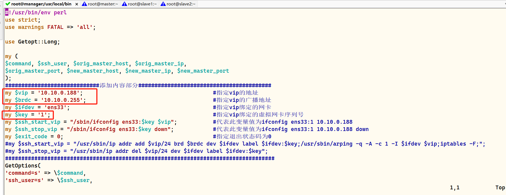


```shell
4）创建 MHA 软件目录并拷贝配置文件，这里使用app1.cnf配置文件来管理 mysql 节点服务器
[root@manager ~]# mkdir /etc/masterha
[root@manager ~]# cp /opt/mha4mysql-manager-0.57/samples/conf/app1.cnf /etc/masterha

[root@manager ~]# vim /etc/masterha/app1.cnf
#删除原有内容，直接复制并修改节点服务器的IP地址

[server default]
manager_log=/var/log/masterha/app1/manager.log
manager_workdir=/var/log/masterha/app1
master_binlog_dir=/usr/local/mysql/data
master_ip_failover_script=/usr/local/bin/master_ip_failover
master_ip_online_change_script=/usr/local/bin/master_ip_online_change
password=manager
ping_interval=1
remote_workdir=/tmp
repl_password=123456
repl_user=myslave
secondary_check_script=/usr/local/bin/masterha_secondary_check -s 10.10.0.130 -s 10.10.0.131
shutdown_script=""
ssh_user=root
user=mha

[server1]
hostname=10.10.0.129
port=3306

[server2]
candidate_master=1
check_repl_delay=0
hostname=10.10.0.130
port=3306

[server3]
hostname=10.10.0.131
port=3306

################################################################################
[server default]
#manager日志
manager_log=/var/log/masterha/app1/manager.log

#manager工作目录
manager_workdir=/var/log/masterha/app1

#master保存binlog的位置，这里的路径要与master里配置的binlog的路径一致，以便MHA能找到
master_binlog_dir=/usr/local/mysql/data/

#设置自动failover时候的切换脚本，也就是上面的那个脚本
master_ip_failover_script=/usr/local/bin/master_ip_failover

#设置手动切换时候的切换脚本
master_ip_online_change_script=/usr/local/bin/master_ip_online_change

#设置mysql中root用户的密码，这个密码是前文中创建监控用户的那个密码
password=manager

#设置监控主库，发送ping包的时间间隔，默认是3秒，尝试三次没有回应的时候自动进行failover
ping_interval=1

#设置远端mysql在发生切换时binlog的保存位置
remote_workdir=/tmp

#设置复制用户的密码
repl_password=123

#设置复制用户的用户
repl_user=myslave

#设置发生切换后发送的报警的脚本
report_script=/usr/local/send_report

#指定检查的从服务器IP地址
secondary_check_script=/usr/local/bin/masterha_secondary_check -s 10.10.0.130 -s 10.10.0.131

#设置故障发生后关闭故障主机脚本（该脚本的主要作用是关闭主机防止发生脑裂,这里没有使用）
shutdown_script=""

#设置ssh的登录用户名
ssh_user=root

#设置监控用户root
user=mha

[server1]
hostname=10.10.0.129
port=3306

[server2]
hostname=10.10.0.130
port=3306
#设置为候选master，设置该参数以后，发生主从切换以后将会将此从库提升为主库，即使这个从库不是集群中最新的slave
candidate_master=1

#默认情况下如果一个slave落后master 超过100M的relay logs的话，MHA将不会选择该slave作为一个新的master， 因为对于这个slave的恢复需要花费很长时间；通过设置check_repl_delay=0，MHA触发切换在选择一个新的master的时候将会忽略复制延时，这个参数对于设置了candidate_master=1的主机非常有用，因为这个候选主在切换的过程中一定是新的master
check_repl_delay=0

[server3]
hostname=10.10.0.131
port=3306
```

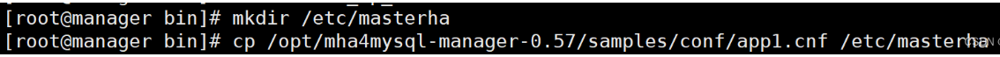

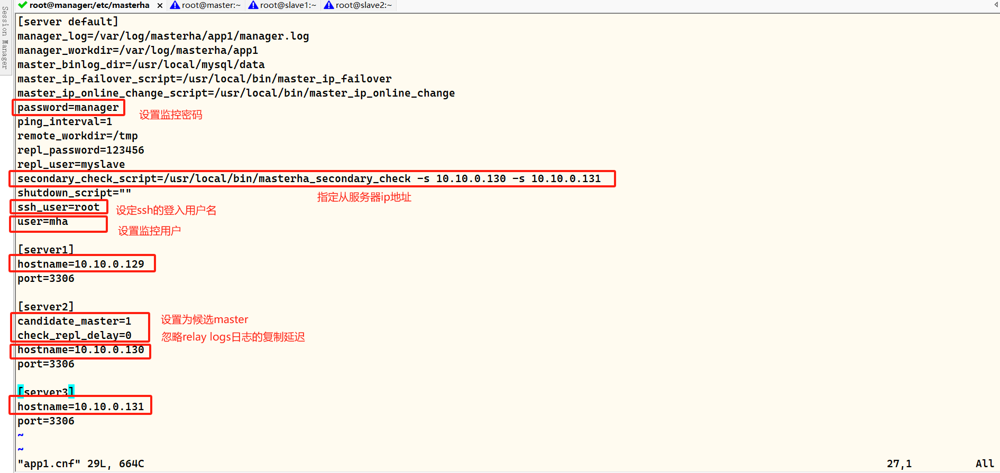


```shell
5）#在主节点开启虚拟IP
[root@master ~]# ifconfig ens33:1 10.10.0.188/24
[root@master ~]# ifconfig
```

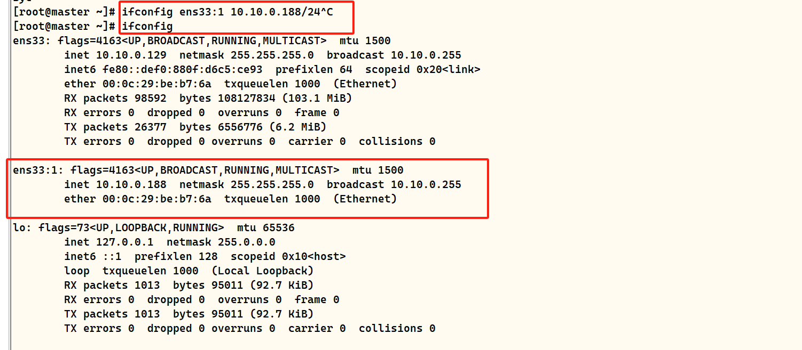


```shell
6）#在 manager 节点上测试 ssh 无密码认证，如果正常最后会输出 successfully。如下所示
[root@manager bin]# masterha_check_ssh -conf=/etc/masterha/app1.cnf
```


```shell
7）#在 manager 节点上测试 mysql 主从连接情况，最后出现 MySQL Replication Health is OK 字样说明正常。如下所示。
[root@manager bin]# masterha_check_repl -conf=/etc/masterha/app1.cnf
```

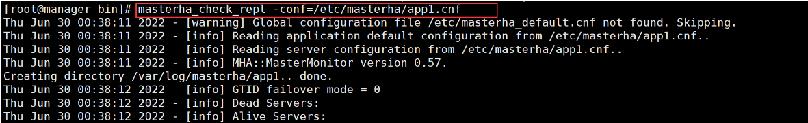

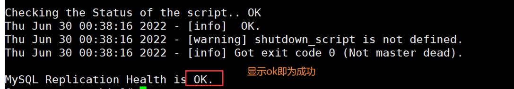


```shell
8）#在 manager 节点上启动 MHA
[root@manager bin]# nohup masterha_manager --conf=/etc/masterha/app1.cnf --remove_dead_master_conf --ignore_last_failover < /dev/null > /var/log/masterha/app1/manager.log 2>&1 &

################################################################################
--remove_dead_master_conf：该参数代表当发生主从切换后，老的主库的 ip 将会从配置文件中移除。
--manger_log：日志存放位置。
--ignore_last_failover：在缺省情况下，如果 MHA 检测到连续发生宕机，且两次宕机间隔不足 8 小时的话，则不会进行 Failover， 之所以这样限制是为了避免 ping-pong 效应。该参数代表忽略上次 MHA 触发切换产生的文件，默认情况下，MHA 发生切换后会在日志记录，也就是上面设置的日志app1.failover.complete文件，下次再次切换的时候如果发现该目录下存在该文件将不允许触发切换，除非在第一次切换后收到删除该文件，为了方便，这里设置为--ignore_last_failover。
################################################################################
```

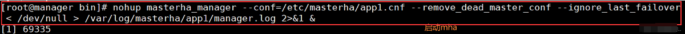


```shell
9）#查看 MHA 状态，可以看到当前的 master 是 master 节点。
[root@manager bin]# masterha_check_status --conf=/etc/masterha/app1.cnf
```


```shell
10）#查看 MHA 日志，也以看到当前的 master 是 10.10.0.129，如下所示。
[root@manager bin]# cat /var/log/masterha/app1/manager.log | grep "current master"
```


```shell
11)#查看 master 的 VIP 地址 10.10.0.188 是否存在，这个 VIP 地址不会因为 manager 节点停止 MHA 服务而消失。
[root@master ~]# ifconfig
```

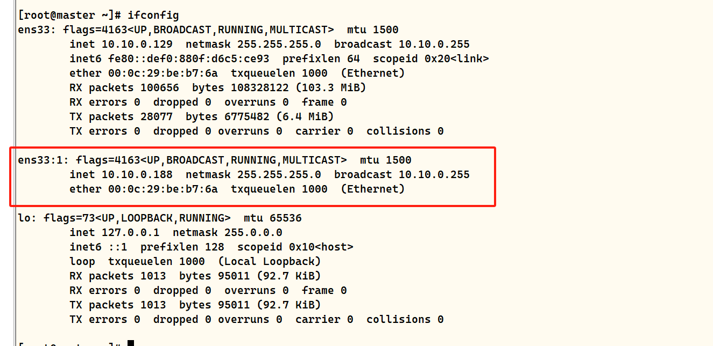

```shell
注：
# 若要关闭 manager 服务，可以使用如下命令。
[root@manager ~]# masterha_stop --conf=/etc/masterha/app1.cnf
或者可以直接采用 kill 进程 ID 的方式关闭。
```

### 3.3 故障模拟

```shell
#在 manager 节点上监控观察日志记录
[root@manager ~]# tail -f /var/log/masterha/app1/manager.log

#在 Master 节点 master 上停止mysql服务
[root@master ~]# systemctl stop mysqld
或
[root@master ~]# pkill -9 mysql
```

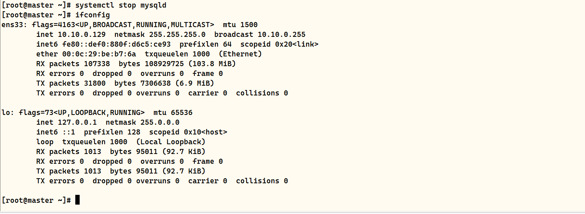


```shell
#正常自动切换一次后，MHA 进程会退出。HMA 会自动修改 app1.cnf 文件内容，将宕机的 master 节点删除。查看 slave1 是否接管 VIP
[root@slave1 ~]# ifconfig
```

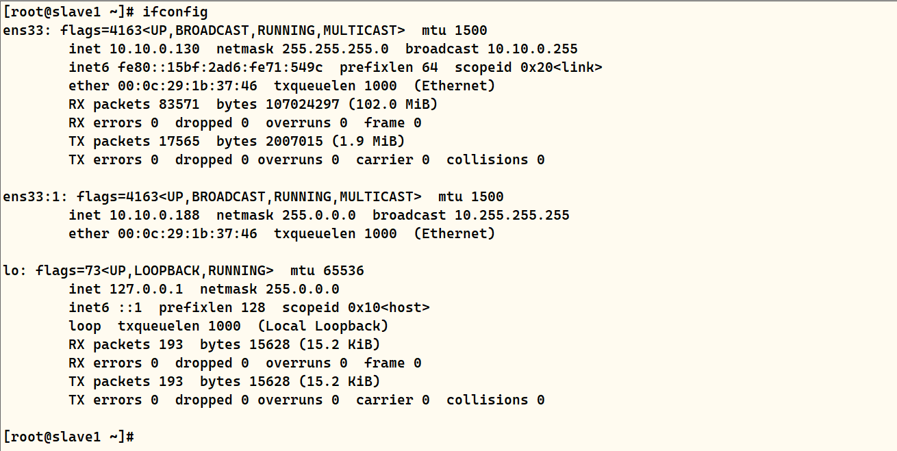

```shell
#检查app1.cnf配置文件
[root@manager ~]# vim /etc/masterha/app1.cnf

[root@test ~]# mysql -u lilj -h 10.10.0.188 -pli@1998..
#模拟故障过程中新增数据、在新的主库上插入数据
mysql> insert into test.test values(4,'xi4');
mysql> insert into test.test values(5,'xi5');
mysql> insert into test.test values(6,'xi6');
```

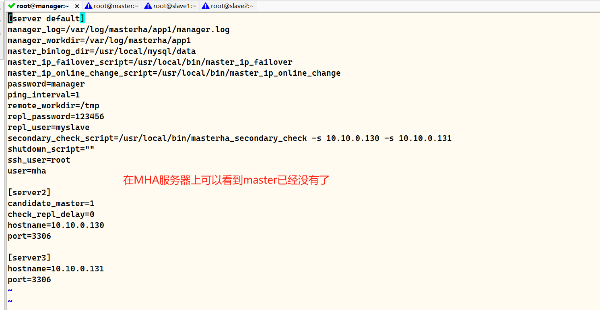

```shell
故障切换备选主库的算法：
	1．一般判断从库的是从（position/GTID）判断优劣，数据有差异，最接近于master的slave，成为备选主。
	2．数据一致的情况下，按照配置文件顺序，选择备选主库。
	3．设定有权重（candidate_master=1），按照权重强制指定备选主。
	（1）默认情况下如果一个slave落后master 100M的relay logs的话，即使有权重，也会失效。
	（2）如果check_repl_delay=0的话，即使落后很多日志，也强制选择其为备选主。
```


### 3.4 故障修复

```shell
1）#修复master
[root@master ~]# vim /etc/my.cnf
#添加如下内容
relay-log = relay-log-bin
relay-log-index = slave-relay-bin.index
relay_log_purge=0

[root@master ~]# systemctl restart mysqld
```

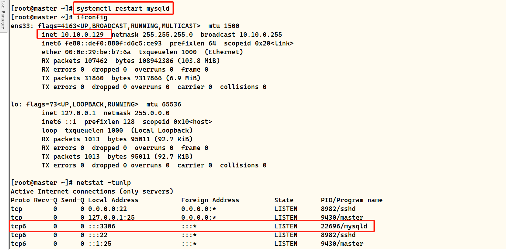


```shell
2）#修复主从
#在现主库服务器 Mysql2（slave1） 查看二进制文件和同步点
mysql> show master status;
mysql> show binlog events in 'master-bin.000004';

#在原主库服务器 mysql1（master） 执行同步操作
mysql> change master to master_host='10.10.0.130',master_user='myslave',master_password='123456',master_log_file='master-bin.000004',master_log_pos=420;
mysql> start slave;
mysql> set global read_only=1;
mysql> show slave status\G
mysql> select * from test.test;

#在现主库服务器 Mysql2（slave1） 执行
mysql> stop slave;
mysql> reset slave;

```

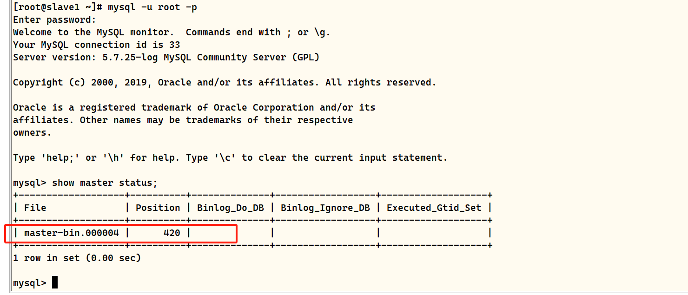

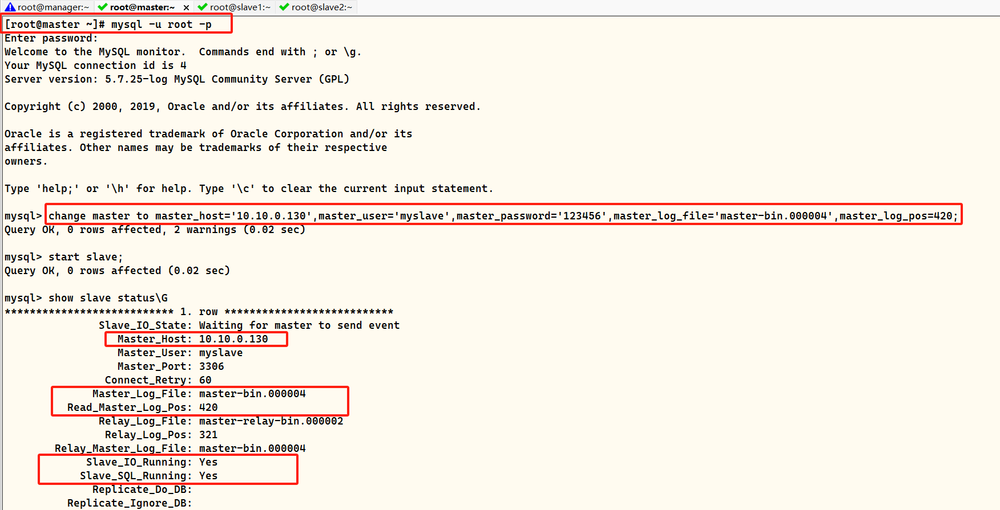


```shell
3）#在 manager 节点上修改配置文件app1.cnf（再把这个记录添加进去，因为它检测掉失效时候会自动消失）
[root@manager ~]# vim /etc/masterha/app1.cnf 
....
secondary_check_script=/usr/local/bin/masterha_secondary_check -s 10.10.0.129 -s 10.10.0.131
....
[server1]
hostname=10.10.0.130
port=3306

[server2]
candidate_master=1
check_repl_delay=0
hostname=10.10.0.129
port=3306

[server3]
hostname=10.10.0.131
port=3306
```


```shell
4）#在 manager 节点上启动 MHA
[root@manager ~]# nohup masterha_manager --conf=/etc/masterha/app1.cnf --remove_dead_master_conf --ignore_last_failover < /dev/null > /var/log/masterha/app1/manager.log 2>&1 &
[root@manager ~]# masterha_check_status --conf=/etc/masterha/app1.cnf
```

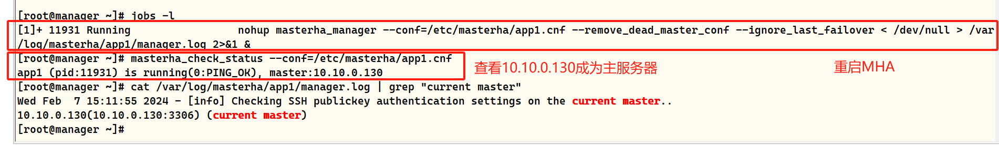


## 四、总结

### 1、mha

① 作用：mysql的高可用 + 故障切换
② 核心部分：
	MHA组件：manager：主要的功能：做MHA 启动、关闭管理和检测mysql各种健康状态
	node：在发生故障时，尽可能的保存二进制日志，并且实验故障切换（VIP地址飘移）
③ MHA需要配置的文件：（2个）
	master ip failover：命令工具，定义的是基于VIP的检测和故障转移（VIP从master---->新的master）
	app1.conf：mha的主要配置文件，主要定义了mha的工作目录、日志
	使用mha的登录mysql的用户、密码使用从服务器
	身份同步master的账号、密码 （五个）
④ 故障切换mha会做哪些动作：
	1）mha会多次尝试测试master的存活状态
	2）mha会多次尝试、尽可能的保存master的二进制日志
	3）mha会根据app1.cnf中的配置备份，进行从服务器-----> 主服务器的位置
	4）mha最后会将master的VIP地址切换到从服务器的位置
	5）mha再选择完新的master之后，会在其余的salve上执行change master操作，指向新的master，来保证mysql的集群	的健康性


### 2、mha故障问题

① 软件链接
② 免交互
③ 五个账号授权 （其中三个账号是测试环境需要做的）
④ 初次运行MHA功能时，需要临时添加虚拟IP
⑤ 配置文件–校验 （master_ip_failover 1个故障切换的脚本，app1.cnf mha的主配置文件）
⑥ 先安装node节点 再安装主节点
