Windows系统 安装git

 

Git bash  支持Linux命令的git控制台（常用）

Git cmd  支持windows命令的git控制台

Git gui  git可视化界面

 

 流程

  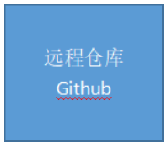

<<=======================================================================================>>

Git操作的具体步骤

1，cd 路径  进入当前目录

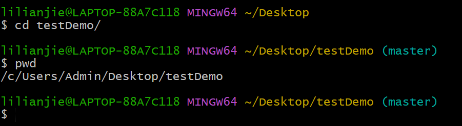

 <<=======================================================================================>>

2，配置git基本操作

git config --global user.name "lilianjie1998"

git config --global user.email ["lilianjie1998@163.com"](mailto:\)

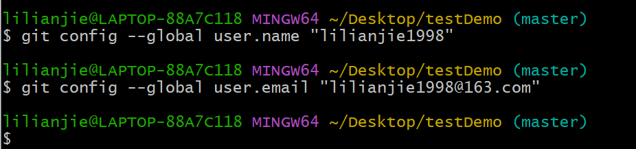

<<=======================================================================================>>

3，git init  在本地进行初始化（建立暂存区）

.git  文件存储当前项目的所有版本信息

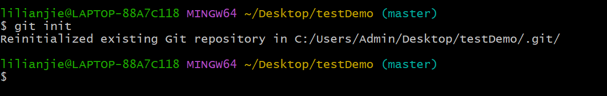

<<=======================================================================================>>

4，工作区=> 暂存区

git add 文件名

git add * 提交所有文件

git commit -m “这一次提交的描述”

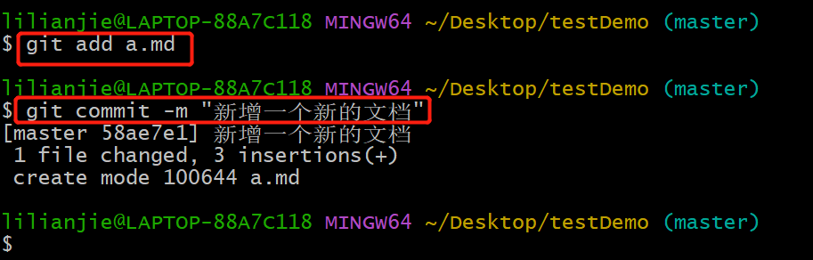

<<=======================================================================================>>

5，查看当前工作区的状态

git status

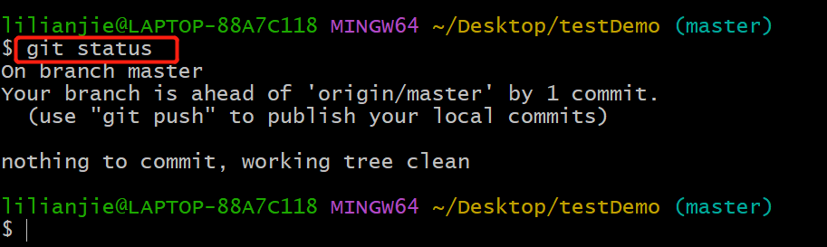

<<=======================================================================================>>

6，从暂存区恢复文件到工作区

git checkout 文件名

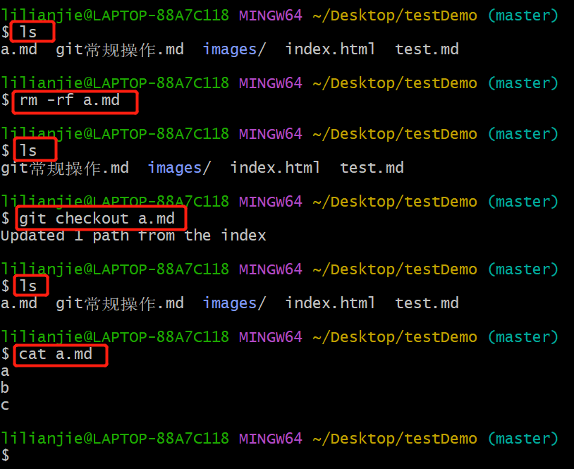

<<=======================================================================================>>

7，查看工作区和暂存区版本区别

 git diff 

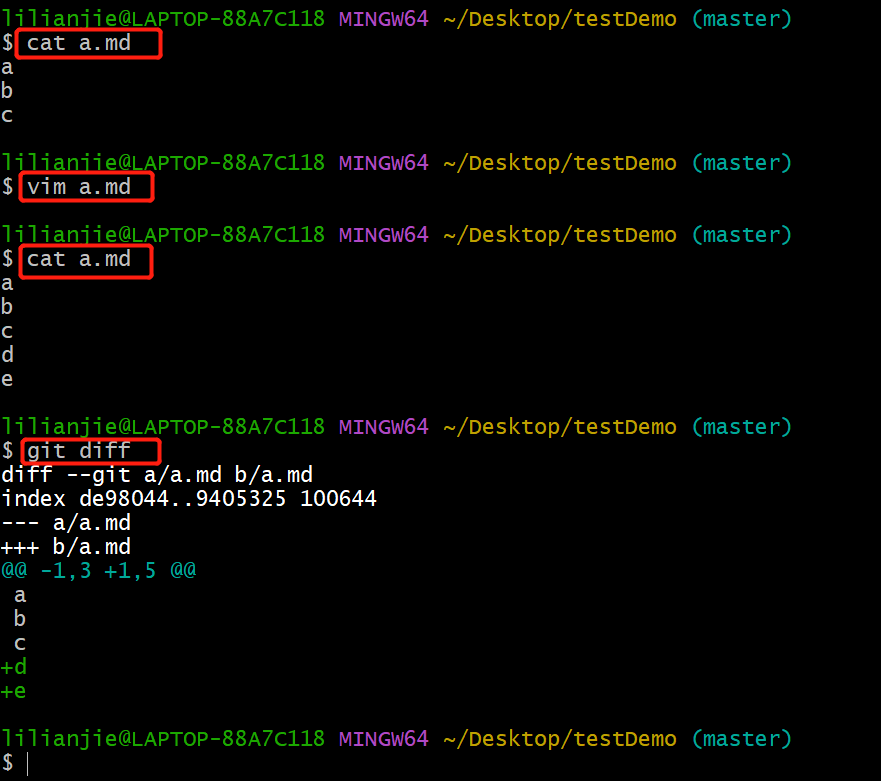

 <<=======================================================================================>>

8，clear 清屏

<<=======================================================================================>>

9，查看已经提交的历史版本

 git log

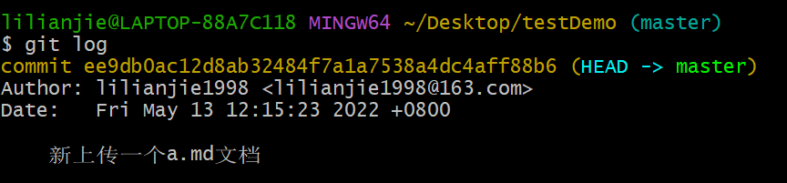

 <<=======================================================================================>>

10，恢复文件到指定的版本

 git reset --hard 版本号

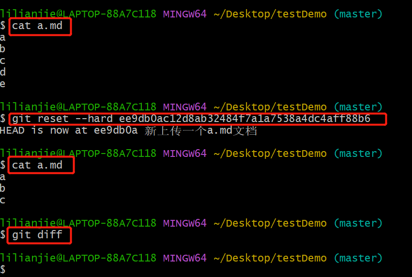

<<=======================================================================================>>

11，生成ssh密钥

①ssh-keygen -t rsa -C “你的github邮箱”

②密钥所在位置Windows电脑路径   /c/Users/Admin/.ssh/id_rsa.pub

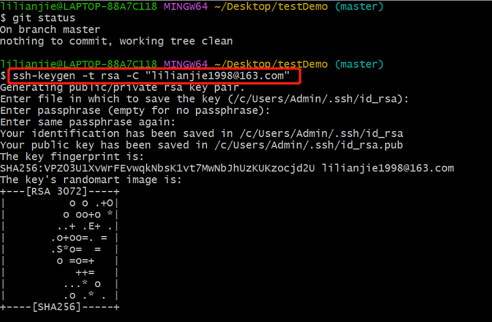

③将pub文件内容，拷贝到github上授权

github头像位置展开>settings>SSH and GPG keys >>New SSH key

 <<=======================================================================================>>

12，暂存区 => 远程仓库

git remote add origin https://github.com/lilianjie1998/testDemo.git

git push -u origin master

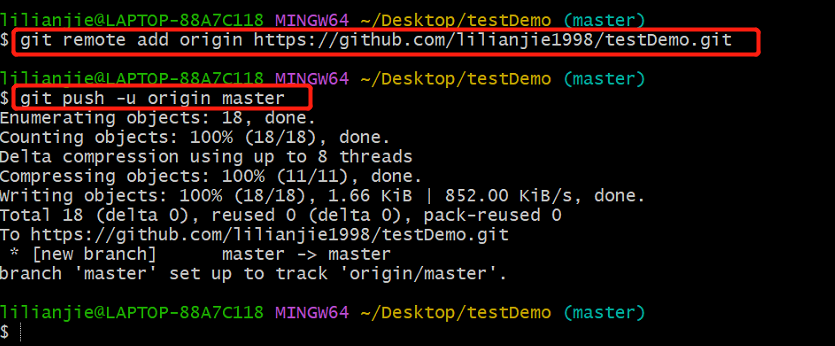

git push origin master的意思就是上传本地当前分支代码到master分支。git push是上传本地所有分支代码到远程对应的分支上。

<<=======================================================================================>>

$ git push origin master

上面命令表示，将本地的master分 支推送到origin主机的master分支。如果后者不存在，则会被新建。

如果省略本地分支名，则表示删除指定的远程分支，因为这等同于推送一个空的本地分支到远程分支。

$ git push origin :master

＃等同于

$ git push origin -delete master

上面命令表示删除origin主机的maste分支。

如果当前分支与远程分支之间存在追踪关系，则本地分支和远程分支都可以省路。

＄ git push origin

上面命令表示，将当前分支推送到origin主机的对应分支。

如果当前分支只有一个追踪分支，那么主机名都可以省路。

$ git push

如果当前分支与多个主机存在追踪关系，则可以使用-u选项指定一个默认主机，这样后面就可以不加任何参数使用git push。

$ git push -u origin master

上面命令将本地的master分支推送到origin主机，同时指定origin为默认主机，后面就可以不加任何参数使用git push了。

<<=======================================================================================>>

13，从远程仓库，克隆项目到本地

 git clone 项目url

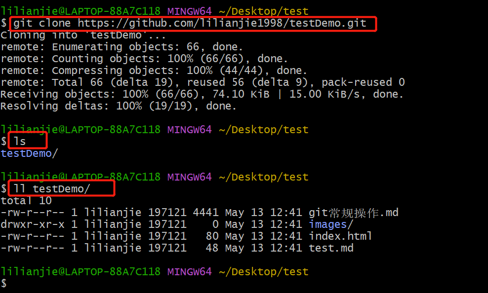

<<=======================================================================================>>

14，从远程仓库同步本地代码（更新）

~/Desktop/testDemo/为我自己的本地项目目录

~/Desktop/test/目录为新建目录，用于测试克隆，同步使用

 git pull

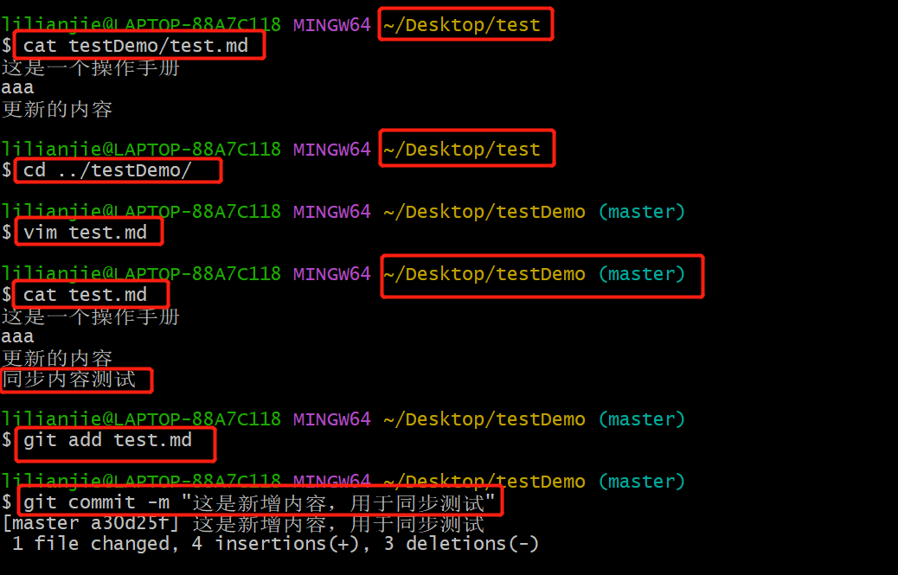

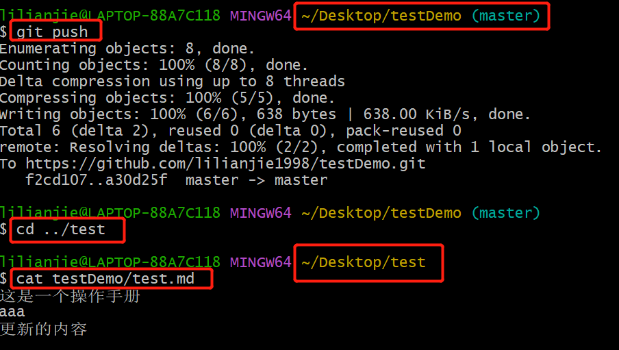

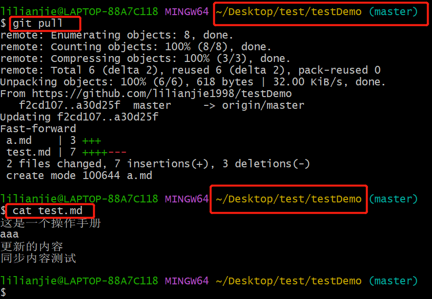

<<=======================================================================================>>